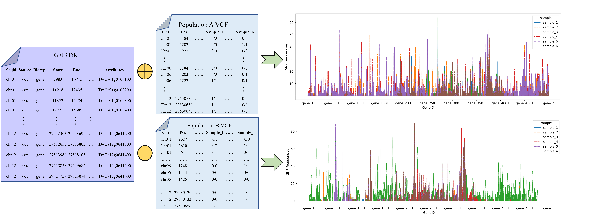

# Genic SNP Composition Tool (GSCtool): a descriptor that characterizes genome for applying machine learning in genomics

GSCtool is the first genomic descriptor that characterizes genome for applying machine learning in genomics. GSCtool counts the number of single nucleotide polymorphisms (SNPs) located in a gene region based on genomic general feature format (GFF3) and variant call format (VCF) (Figure 1).




<center>Figure 1. The flow that GSCtool extracts the information from the specific files</center>

## Introdcution

The number of SNPs located in gene region is closely related to gene function. As we all know, the genic regions are more conserved than non-genic regions, thus the number of genic SNPs, to a certain extent, reflects the conservativeness of genes and captures most of the biologically important variants. Therefore, we intended to develop a genomic descriptor that recorded the number of SNPs of individual genes to represent the genome feature.

The location and status of SNPs is required for the descriptor. The VCF file is a text file that stores the variations at a whole-genome level. The GFF3 file contains both location and gene information of SNPs. We developed the descriptor, GSCtool, to count the number of SNPs in the VCF file based on the gene information from the GFF3 file to characterize the genome (as shown in Figure 1). The physical location of genes on chromosomes is ordered. The features generated by GSCtool can be considered a time-series(Figure 1).The GSCtool is defined as follows：

$$
G_i=Count\left(SNP_{i_0},SNP_{i_1}\ldots S N P_{i_n}\right)
$$

$$
F=Vector\left(G_1,G_2\ldots G_n\right)
$$

where $G_i$ represents the SNP frequency ( $Count\left(SNP_{i_0},SNP_{i_1}\ldots SNP_{i_n}\right)$ ) of $Gene_i$, $F$ includes SNP frequency of all genes ( $G_1,G_2\ldots G_n$ ) in the genome.


## Usage

This script takes as input a VCF file(compressed) and a GFF3 File.

```bash
$ python genome_descriptor.py --help
usage: genome_descriptor.py [-h] --gzvcf GZVCF --gff3 GFF3 --outfile OUTFILE

GSCtool is the first genomic descriptor that characterizes genomesfor applying machine learning in genomics. GSCtool counts the number of single nucleotide polymorphisms (SNPs) located in a gene region based on genomic general feature format (GFF3) and variant call format (VCF).


optional arguments:
  -h, --help         show this help message and exit
  --gzvcf GZVCF      The gzvcf file of individual or population
  --gff3 GFF3        The gff3 file which corresponds to the spieces of the gzvcf
  --outfile OUTFILE  The name of output file with csv format, which records the features of genome
```

**Note**
```diff

+ When using our genomic feature extraction tools, please ensure the following to avoid potential errors:
- Maintain a consistent reference genome: Please ensure that the VCF (Variant Call Format) files of different populations and individuals use the same reference genome for variant detection. This will avoid erroneous results due to different reference genomes.

- Confirm GFF3 file match: When using, please verify that the GFF3 (General Feature Format version 3) file matches the reference genome exactly. If the GFF3 file does not correspond to the reference genome, it may lead to errors or invalid results in the feature extraction process.
```

## Example

Extracting features from a population:

```bash
python3 genome_descriptor.py --gzvcf data/rice_population.vcf.gz --gff3 GFF3/rice.gff --outfile features/rice_population_features.csv
```

Extracting features from individuals

```bash
# rice 
python3 genome_descriptor.py --gzvcf data/rice_individual.vcf.gz --gff3 GFF3/rice.gff --outfile features/rice_individual_features.csv
# homo sapiens
python3 genome_descriptor.py --gzvcf data/homo_individual.vcf.gz --gff3 GFF3/Homo_sapiens.GRCh38.106.gff3 --outfile features/homo_individual.csv
```

## Cite

Zijie Shen#, Enhui Shen#, Qianhao Zhu,Longjiang Fan, Quan Zou* and Chuyu Ye*. GSCtool: a descriptor that characterizes genome for applying machine learning in genomics.

Please email me if you have any questions: shenzijie2013@163.com
