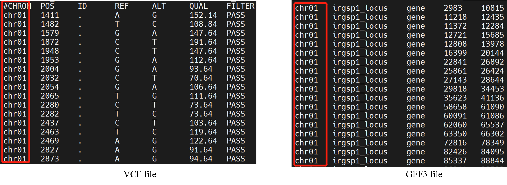

# SNPs Composition of Gene Tool(SCGtool)

The first descriptor characterizes the genome. It counters the single nucleotide polymorphisms(SNPs) of genes from ariant Call Format (VCF) file based on General Feature Format(GFF3) (as shown Figure 1).


<center>Figure 1. The process that SCGtool extract the information</center>

## Introdcution

SNP variants may result in the functional change of a gene. As the SNP number of a gene increases, the change rate of the gene function is higher. Based on the concept of conserved sequence, we conclude that the number of mutations on a gene can also be used as a feature. Therefore, we intend to develope a descriptor calculated the number of SNPs per gene as the genome features. To achieve the descritptor, we need to know the SNPs and which genes they're on. The VCF specifies the format of a text file storing gene sequence variations. But it doesn't record which gene the SNPs belong to. The following two files contain the owning information of SNPs:

1. Annotated VCF file;
2. GFF3 File;

If some genes of some population or individuals haven't any SNPs, then the first approach would generate inconsistent feature space on different samples. The GFF3 is used for describing genes contained the region and location on chromosome. Therefore, we developed the descriptor, named SCGtool, counted the variations of VCF file based on the genes information of GFF3 to characterize the genome (as shown Figure 1). The physical location of genes on chromosomes is ordered. The features generated by SCGtool can be viewed as time series(Figure 1).The SCGtool is defined as follows：

$$
F=Vector\left(G_1,G_2\ldots G_n\right)
$$

$$
G_i=Count\left(SNP_{i_0},SNP_{i_1}\ldots S N P_{i_N}\right)
$$

where $G_i$ represents the SNPs frequency ( $Count\left(SNP_{i_0},SNP_{i_1}\ldots SNP_{i_N}\right)$ ) of $Gene_i$, $F$ include SNPs frequency of all genes ( $G_1,G_2\ldots G_n$ ) on the genome. Whose features were temporary called SNPs time-series.

## Usage

This script takes as input a VCF file and a GFF3 File.

```bash
$ python genome_descriptor.py --help
usage: genome_descriptor.py [-h] --gzvcf GZVCF --gff3 GFF3 --outfile OUTFILE

The descriptor characterizes the genome. The script counts the number of
single nucleotide polymorphisms(SNPs) per gene id of VCF files depend on
GFF3 record.

optional arguments:
  -h, --help         show this help message and exit
  --gzvcf GZVCF      The gzvcf file of individual or population
  --gff3 GFF3        The gff3 file which corresponds to the spieces of the gzvcf
  --outfile OUTFILE  The name of output file with csv format, which records the features of genome
```

**note**: The "CHROM" of VCF is consistent with the seqid of gff3, name of the chromosome or scaffold. As shown in Figure2, the context and sort of "CHROM" of VCF (red box of VCF file) is chr01, chr02 .... chrxx, similarly, the seqid of gff3(red box of GFF3) are chr01, chr02 .... chrxx, too.



<center>Figure 2</center>

## Example

Extracting features from a population:

```bash
python3 genome_descriptor.py --gzvcf data/rice_population.vcf.gz --gff3 GFF3/rice.gff --outfile features/rice_population_features.csv
```

Extraction features from individuals

```bash
# rice 
python3 genome_descriptor.py --gzvcf data/rice_individual.vcf.gz --gff3 GFF3/rice.gff --outfile features/rice_individual_features.csv
# homo sapiens
python3 genome_descriptor.py --gzvcf data/homo_individual.vcf.gz --gff3 GFF3/Homo_sapiens.GRCh38.106.gff3 --outfile features/homo_individual.csv
```

## Cite

Zijie Shen#, Enhui Shen#, Chuyu Ye, Quan Zou* and Longjiang Fan*. SNP Composition of Genes Tool(SCGtool): The first genomic descriptor contributing to the machine learning for genome omics.
Please email me if you have any questions:shenzijie2013@163.com
